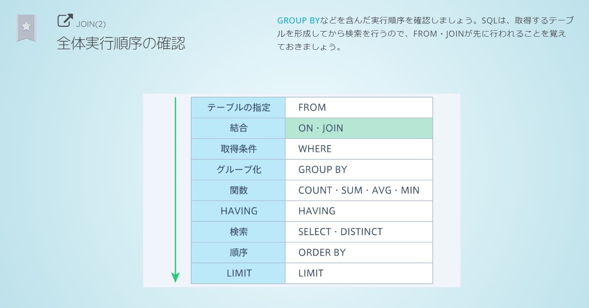

# SQL
## クエリ
| クエリ | 意味 |
| --- | --- |
| select aaa from bbb| bbbからaaaを取得する|
| where | 条件|
| where aaa like "%bbb%" | aaaがbbbを含む条件|
|where not aaa = "bbb"|否定|
| where aaa is null | aaaがnullである条件|
|where aaa is not null | aaaがnullでない条件|
|where A and B| AかつBの条件|
|where A or B | AまたはBの条件|
|order by カラム名 desc|降順|
|order by カラム名 asc|昇順|
|limit データの件数|最大で何件取得するか(クエリの末尾に記述)|
|distinct(カラム名)|検索結果から指定したカラムの重複するデータを除く|
|group by カラム名| 指定したカラムでグループ分け group byを使う場合、selectには集計関数かgroup byで指定しているカラム名しか使えない|
| having|グループ化したデータを絞り込む条件 |
| select aaa as "bbb" | aaaをbbbと表示する|
|join aaa on A|Aの条件でaaaテーブルを結合|
|left join|外部キーがnullのレコードも含め結合|

## ワイルドカード
- どんな文字列にも一致することを指す記号
- "%aaa" : aaaで終わる
- "aaa%" : aaaで始まる
- "%aaa%" : aaaを含む
  

## likeと＝の違い
- likeはワイルドカードが使用できるため、パターン検索ができる
- =は空白が無視されるが、likeは空白まで厳密に比較する
- =は大文字小文字を区別するが、likeは区別しない

## havingとwhereの検索対象の違い
- where : グループ化される前のテーブル全体
- having : グループ化されたデータ

## サブクエリ
- クエリの中に他のクエリを入れる
サブクエリの実行後、外側のクエリが実行される

## クエリの実行順序
