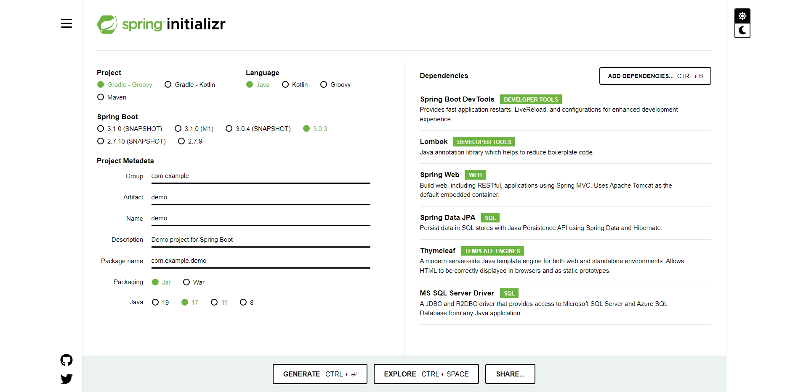

# Spring Boot で web アプリを開発

## 環境

- 統合開発環境：IntelliJ
- ビルドツール：Gradle
- DB：SQL Server

## Spring Boot プロジェクトを作成

[spring initializr](https://start.spring.io/) で以下の設定をし、Generate



| 項目             | 選択                                                                                                 |
| ---------------- | ---------------------------------------------------------------------------------------------------- |
| Project          | Gradle - Groovy                                                                                      |
| Language         | Java                                                                                                 |
| Spring Boot      | 3.0.3                                                                                                |
| Project Metadata | Group : com.{パッケージ名}<br>Artifact : {プロジェクト名}<br>Packaging : War<br>Java : 17            |
| Dependencies     | Spring Boot DevTools<br>Lombok<br>Spring Web<br>Spring Data JPA<br>Thymeleaf<br>MS SQL Server Driver |

### Gradle

- ビルドツール
- build.gradle に設定を記述する（ビルドツールが Maven の場合は pom.xml に記述する内容）。

### Thymeleaf(タイムリーフ)

#### 参考

- [Spring Boot で Thymeleaf 使い方メモ](https://qiita.com/opengl-8080/items/eb3bf3b5301bae398cc2)
- [Thymeleaf とは？基本構文・Spring Boot での使い方を解説](https://camp.trainocate.co.jp/magazine/about-thymeleaf/)

#### 概要

- テンプレートエンジン
- Spring Boot では利用が推奨されている。Spring Boot のデフォルト設定では、クラスパス以下の /resources/templates/{Controller の戻り値}.html でテンプレートファイルが探索される。

## SQL Server で DB を作成し、接続

- Mictosoft SQL Server Manegement Studio で操作。
- sa アカウントで接続し、「データベース」を右クリック。新しいデータベースを作成。
- 作成したデータベースを右クリック。新しいクエリでテーブル作成。
- ログインユーザを sa 以外に作成し、ロールを分けるのがセキュリティ上よい。

- application.properties に以下を記述。
  - https://getpocket.com/ja/read/3812397575
  - https://blog.engineer-memo.com/2022/05/12/jdbc-runner-%E3%82%92-sql-server-%E3%81%AB%E5%AF%BE%E3%81%97%E3%81%A6%E5%AE%9F%E8%A1%8C%E3%81%99%E3%82%8B%E9%9A%9B%E3%81%AE%E3%83%A1%E3%83%A2/

```
spring.datasource.url=jdbc:sqlserver://localhost:{ポート番号};databaseName={DB名};encrypt=false
spring.datasource.username={ログインユーザ名}
spring.datasource.password={パスワード}
spring.datasource.driverClassName=com.microsoft.sqlserver.jdbc.SQLServerDriver
```

## IntelliJ でプロジェクトを開く

- IntelliJ で開きたいプロジェクトの build.gradle を開く
