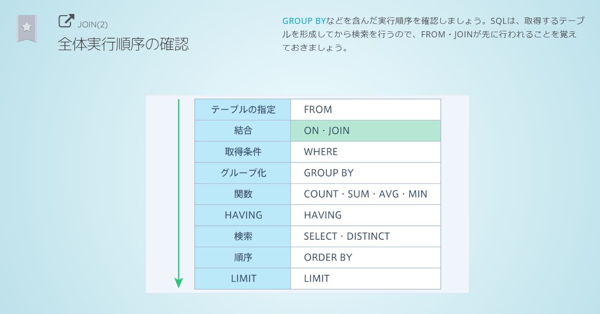

# SQL

## クエリ

| クエリ                 | 意味                                                                                                                   |
| ---------------------- | ---------------------------------------------------------------------------------------------------------------------- |
| select aaa from bbb    | bbb から aaa を取得する                                                                                                |
| where                  | 条件                                                                                                                   |
| where aaa like "%bbb%" | aaa が bbb を含む条件                                                                                                  |
| where not aaa = "bbb"  | 否定                                                                                                                   |
| where aaa is null      | aaa が null である条件                                                                                                 |
| where aaa is not null  | aaa が null でない条件                                                                                                 |
| where A and B          | A かつ B の条件                                                                                                        |
| where A or B           | A または B の条件                                                                                                      |
| order by カラム名 desc | 降順                                                                                                                   |
| order by カラム名 asc  | 昇順                                                                                                                   |
| limit データの件数     | 最大で何件取得するか(クエリの末尾に記述)                                                                               |
| distinct(カラム名)     | 検索結果から指定したカラムの重複するデータを除く                                                                       |
| group by カラム名      | 指定したカラムでグループ分け group by を使う場合、select には集計関数か group by で指定しているカラム名しか使えない |
| having                 | グループ化したデータを絞り込む条件                                                                                     |
| select aaa as "bbb"    | aaa を bbb と表示する                                                                                                  |
| join aaa on A          | A の条件で aaa テーブルを結合                                                                                          |
| left join              | 外部キーが null のレコードも含め結合                                                                                   |

## ワイルドカード

- どんな文字列にも一致することを指す記号
- "%aaa" : aaa で終わる
- "aaa%" : aaa で始まる
- "%aaa%" : aaa を含む

## like と＝の違い

- like はワイルドカードが使用できるため、パターン検索ができる
- =は空白が無視されるが、like は空白まで厳密に比較する
- =は大文字小文字を区別するが、like は区別しない

## having と where の検索対象の違い

- where : グループ化される前のテーブル全体
- having : グループ化されたデータ

## サブクエリ

- クエリの中に他のクエリを入れる
  サブクエリの実行後、外側のクエリが実行される

## クエリの実行順序

