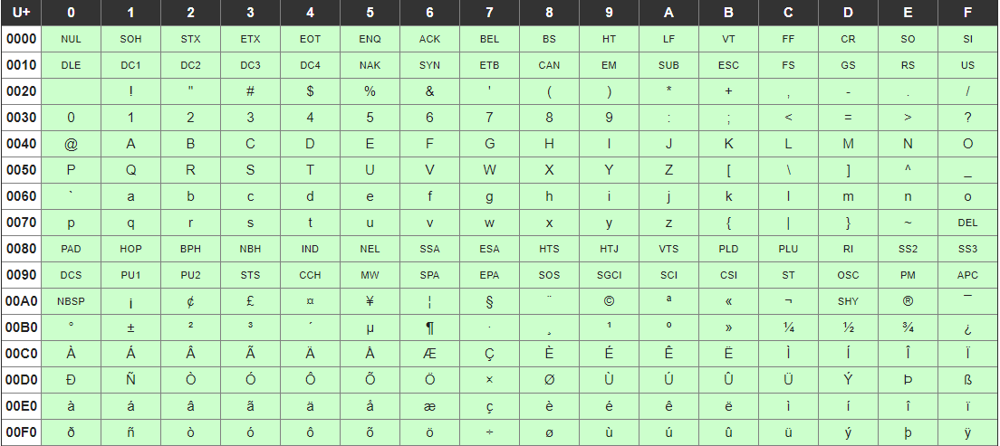

# 正規表現
- 文字列の検索パターンを表現する記法
- 大文字小文字を区別する
- 言語やツールで若干の違いがある
- 検索（Ctrl + F）にて、「.*」をオンにすると検索で正規表現を使用できる

## 記法
1. リテラル
   - 文字そのものを入力する
   - 例："cat"を見つけたい→catと検索
1. メタ文字
   - 高度な検索パターンをつくれる

| メタ文字 | 意味 |
| ---------| ---- |
|.|改行を除く任意の1文字|
|\ |エスケープ（メタ文字になっている文字を検索）|
|\d |0-9|
|\w |a-z,A-Z,0-9,_|
|\s |スペース、タブ、改行等|
|\D |\d以外（\dの否定）|
|\W |\w以外|
|\S |\s以外|
|{n} |量指定子（直前の文字をn個繰り返す）|
|{min,max} |量指定子（min以上、max以下）|
|{min,} |量指定子（min以上）|
|? |量指定子（0個か1個の繰り返し）|
|+ |量指定子（1個以上の繰り返し）|
|* |量指定子（0個以上の繰り返し）|
|量指定子? |一番短い一致する文字列|
|^ |アンカー（行の先頭）|
|$ |アンカー（行の末尾）|
|\b |単語の境界|
| \| |選択肢|
|[abc] |文字クラス（[]で囲まれた文字のどれか1文字）|
|[^ab] |否定（a,b以外の1文字）<br>これが否定の意味を持つのは、文字クラス内で[の直後に置かれた場合のみ|
|[a-c] |範囲(a,b,cのどれか1文字)<br>文字コード表の順番が重要、さかのぼるような指定はできない<br>|
|\t |タブ|
|\r\n |改行（Windows）|
|\r |改行（Ver.9までのmacOS）|
|\n |改行（Unix、Ver.10意向のmacOS）|
|\r\n\|\r\|\n |改行（選択肢によって全てのOSに対応）|


## キャプチャ
()で囲んだ範囲が、順に$1,$2,... として保存される
### 使用例
「サイト名,URl」の構造で保存されているデータから、HTMLのリンクをつくる<br>
<データ><br>
dotinstall, dotinstall.com<br>
google,google.com<br>
example,example.com<br>
<br>
<正規表現での検索><br>
(.+),\s?(.+)<br>
<br>
<置換する文字列><br>
``` <a href="$2">$1</a> ```

## 後方参照
()でキャプチャした内容を正規表現中で使う<br>
キャプチャした順に\1,\2,...として使用できる
### 使用例
同じ点数が連続するデータを取り出す<br>
<データ><br>
3, 8, 5, 4, 4, 5, 4, 1, 1, 5, 3, 3<br>
<br>
<正規表現での検索><br>
(\d),\s\1   ←「\d」＝「\1」


## 注意すべき例
### example.txt と example.pdf の両方をヒットさせたい
→〇example.txt|example.pdf<br>
→〇example.(txt|pdf)<br>
- ()で、選択肢の範囲を明示的に示しているためOK<br>
  
→✕example.txt|pdf<br>
- 「example.txt」か「pdf」という選択肢として認識されてしまう

### 文字クラス内でエスケープする文字
- エスケープすべき文字は、文字クラスの内外で異なる
- 文字クラス内でエスケープすべき文字は、文字クラス内で特殊な意味を持つ文字のみ<br>
→ ^ - [ ] \ は必要<br>
  - ^は[の直後でなければ特別な意味を持たないため、順番を変えればエスケープは不要<br>

